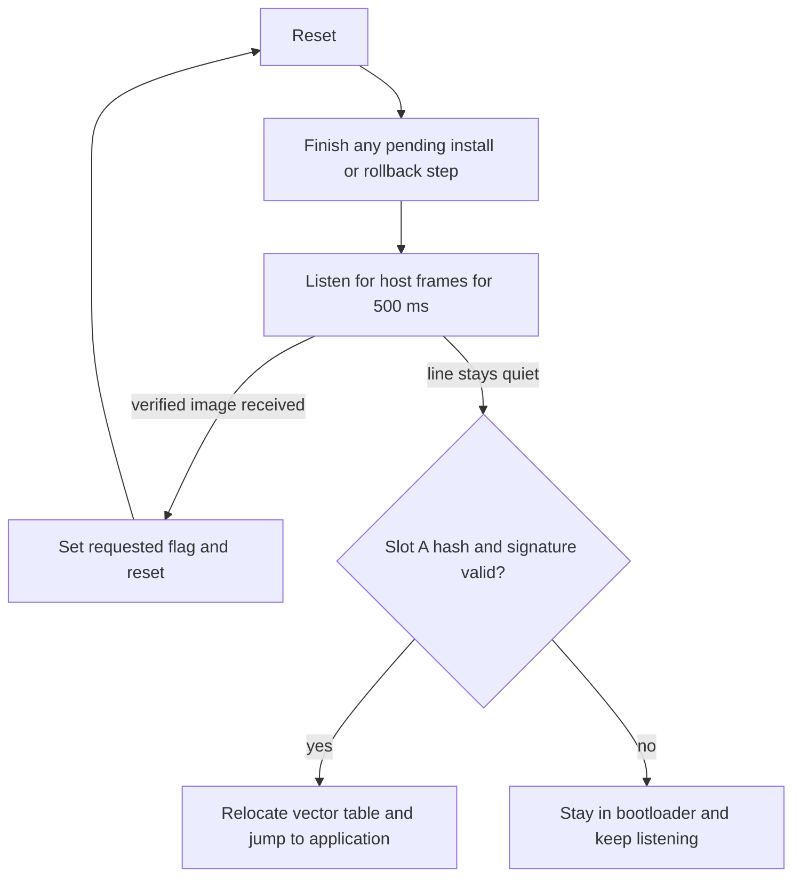

# stm32-bootloader

A bare-metal bootloader for the STM32F401RE (NUCLEO-F401RE) that accepts firmware over UART, verifies an ECDSA P-256 signature before running anything, and rolls back to the previous image if a new one fails to confirm itself.

Written in C with no vendor HAL: the linker scripts, startup code, and UART, flash and timer drivers are all in this repository. The only third-party code is [micro-ecc](https://github.com/kmackay/micro-ecc) for the elliptic-curve maths.

> **Status: work in progress.** The update, signature and rollback paths work on hardware. Power-loss testing, a watchdog and the timing measurements are not done yet. See [Failure-mode testing](#failure-mode-testing) and [Limitations](#limitations) for exactly what has and has not been verified.

## What it does

- Splits flash into a bootloader region, a running slot, a download slot and a backup slot.
- Receives an image over UART in CRC-protected frames and writes it to the download slot.
- Checks the image's SHA-256 hash and ECDSA P-256 signature against a public key compiled into the bootloader. This happens after every transfer and again on every boot.
- Installs a verified image by backing up the current one first, then starts the new image on trial.
- Rolls back to the backup on the next reset if the new image has not confirmed itself.
- Ships with a Python tool that packs, signs and sends images, and host-side unit tests that run in CI.

## Flash layout

The STM32F401RE has 512 KB of flash in sectors of uneven size. Regions follow sector boundaries because flash can only be erased a whole sector at a time.

| Region | Sectors | Address | Size | Purpose |
|---|---|---|---|---|
| Bootloader | 0-2 | `0x08000000` | 48 KB | This project |
| Boot state | 3 | `0x0800C000` | 16 KB | Six update progress flags |
| Unused | 4 | `0x08010000` | 64 KB | |
| Slot A | 5 | `0x08020000` | 128 KB | The image that runs |
| Slot B | 6 | `0x08040000` | 128 KB | Download area for a new image |
| Backup | 7 | `0x08060000` | 128 KB | Copy of the previous image |

The application is linked to run from slot A only. A new image is downloaded to slot B, then copied into slot A.

## Boot flow



Before jumping, the bootloader stops its timer, points `VTOR` at the application's vector table, loads the application's initial stack pointer and branches to its reset handler.

## Update and rollback

Progress is recorded in six flag words in the boot state sector. Each flag starts erased and is written once, so setting a flag never needs an erase. On every reset the bootloader reads the flags and takes one next step:

| Flags set so far | Next step |
|---|---|
| None | Run the application |
| Requested | Copy slot A to the backup sector |
| + Backup done | Copy slot B to slot A |
| + Install done | Mark trial started, run the new image |
| + Trial started, not confirmed | Restore the backup into slot A |
| Confirmed, or rollback done | Clear the flags |

A flag is set only after its step has fully finished, and every copy is verified (hash and signature) before its flag is set. If a step is interrupted, the flag is still unset on the next boot and the same step runs again from a source that was not modified.

The new application sets the "confirmed" flag itself once it is running. If it resets before doing so, the bootloader restores the previous image.

The decision logic is a pure function (`common/bootplan.c`) with a host test that checks every one of the 64 flag combinations reaches an application start.

## Image format

Every image starts with a 512-byte header, followed by the application code. The header is 512 bytes so that the vector table after it is correctly aligned; the application therefore starts at `0x08020200`.

| Offset | Size | Field |
|---|---|---|
| 0 | 4 | Magic number `FWI1` |
| 4 | 4 | Version |
| 8 | 4 | Size of the code in bytes |
| 12 | 4 | Reserved |
| 16 | 32 | SHA-256 of the code |
| 48 | 64 | ECDSA P-256 signature (r then s, big-endian) |
| 112 | 400 | Padding (`0xFF`) |

Multi-byte integers are little-endian. The signature covers the first 48 bytes of the header. Because those bytes include the hash of the code, the signature protects the code, its size and its version number.

## UART protocol

115200 baud, 8N1, over the Nucleo's on-board ST-Link virtual COM port (USART2, PA2/PA3).

Frame: `0xA5` start byte, 1-byte type, 2-byte payload length (little-endian, at most 256), payload, then a CRC-32 (little-endian) over type, length and payload.

| Type | Name | Direction | Payload |
|---|---|---|---|
| `0x01` | PING | host to device | none |
| `0x10` | START | host to device | image size, image CRC-32 |
| `0x11` | DATA | host to device | offset, then up to 252 bytes |
| `0x12` | END | host to device | none |
| `0x81` | ACK | device to host | protocol version (PING) or next offset |
| `0x82` | NACK | device to host | one error code |

The host waits for each ACK before sending the next frame, because the CPU cannot receive while a flash sector is being erased. A repeated DATA frame is acknowledged without being written twice.

| Error code | Meaning |
|---|---|
| `0x02` | Frame length field too large |
| `0x03` | Frame CRC mismatch |
| `0x10` | Unknown message type |
| `0x20` | Bad payload length |
| `0x21` | Image too large for the slot |
| `0x22` | Flash erase or write failed |
| `0x23` | Message not valid in the current state |
| `0x24` | Unexpected data offset |
| `0x25` | Image CRC mismatch after transfer |
| `0x26` | Image header or hash invalid |
| `0x27` | Signature invalid |
| `0x28` | An update is already in progress |

## Repository layout

| Path | Contents |
|---|---|
| `boot/` | Bootloader: main loop, update handler, install and rollback, public key |
| `app/` | Sample application, built as three variants (v1, v2, and a "bad" build that never confirms) |
| `common/` | Code shared by bootloader, application and host tests: startup, UART, flash, CRC-32, SHA-256, framing, image checks, boot state |
| `ld/` | Linker scripts: one memory map per program plus a shared section layout |
| `tools/` | `imgtool.py` (pack, keygen, sign), `fwtool.py` (ping, send), `monitor.py` (serial log viewer) |
| `tests/` | Host-side unit tests |
| `third_party/micro-ecc/` | Git submodule |

## How to reproduce

### Hardware

- NUCLEO-F401RE and a USB cable. Nothing else: the on-board ST-Link provides both the debugger and the serial port.

### Tools

On Windows, install [MSYS2](https://www.msys2.org), open the **UCRT64** shell and run:

```bash
pacman -S --needed git make mingw-w64-ucrt-x86_64-gcc \
    mingw-w64-ucrt-x86_64-arm-none-eabi-gcc mingw-w64-ucrt-x86_64-arm-none-eabi-newlib \
    mingw-w64-ucrt-x86_64-openocd mingw-w64-ucrt-x86_64-python \
    mingw-w64-ucrt-x86_64-python-pyserial mingw-w64-ucrt-x86_64-python-cryptography
```

Also install ST's ST-Link USB driver (STSW-LINK009).

On Ubuntu, the equivalent packages are `gcc-arm-none-eabi`, `libnewlib-arm-none-eabi`, `openocd`, `python3-serial` and `python3-cryptography`. CI builds and tests on Ubuntu; flashing from Linux has not been tested.

Developed with arm-none-eabi-gcc 16.1.0, GNU Make 4.4.1, OpenOCD 0.12.0 and Python 3.14.

### Get the code

```bash
git clone --recurse-submodules https://github.com/kandarpvaidya03-art/stm32-bootloader.git
cd stm32-bootloader
```

### Create your own signing key

The private key is never committed. The `boot/pubkey.c` in this repository matches the author's private key, so to sign images yourself you need your own pair:

```bash
python tools/imgtool.py keygen keys/signing_key.pem
python tools/imgtool.py pubkey keys/signing_key.pem boot/pubkey.c
```

`keys/` is listed in `.gitignore`. Keep the `.pem` file private.

### Build and test

```bash
make test      # host-side unit tests
make           # bootloader and unsigned application images
make signed    # signed application images (needs the private key)
```

### Flash

```bash
make erase       # wipe the chip
make flash-boot  # bootloader
make flash-app   # signed version 1 application into slot A
```

To watch the boot log, replace `COM24` with your port (`python -m serial.tools.list_ports` lists them):

```bash
python -u tools/monitor.py COM24
```

Only one program can hold the serial port at a time, so stop the monitor before using `fwtool.py`.

### Send an update

```bash
python tools/fwtool.py COM24 send build/app-v2-signed.bin
```

Press the board's reset button when prompted. The tool transfers the image, then prints the board's log while it backs up, installs and trial-boots the new version.

To see a rollback, send `build/app-bad-signed.bin` (a correctly signed build that never confirms itself), wait for it to start, then press reset.

Holding the user button (B1) during reset runs a flash self-test that erases slot B and writes and reads back a test pattern.

## Tests and CI

`make test` builds and runs six host-side test programs on the development machine, with no board attached:

| Test | Covers |
|---|---|
| `test_crc32` | Reference value, incremental use, bit-flip detection |
| `test_frame` | Round trips, corrupted, oversized and truncated frames, resynchronisation |
| `test_sha256` | Published test vectors, including a one-million-byte input |
| `test_image` | Header checks and hash mismatch |
| `test_image_sig` | Valid signature, altered fields, wrong key, missing signature |
| `test_bootplan` | Update and rollback sequences, all 64 flag combinations |

GitHub Actions runs these tests and builds the firmware on every push. CI has no private key, so it does not produce signed images.

Flash, UART and the jump to the application cannot be tested on the host. Those are tested by hand on the board.

## Failure-mode testing

| Failure case | Expected behaviour | Status |
|---|---|---|
| Missing signature | Image rejected | Tested on hardware: unsigned image refused with `0x27` after transfer, and refused at boot |
| Tampered header | Image rejected | Tested on hardware: one flipped bit in the version field refused with `0x27` |
| Image with no header | Image rejected | Tested on hardware: refused with `0x26` |
| New image never confirms | Rollback to previous image | Tested on hardware: previous version restored on the next reset |
| Corrupted code (bit flip in the body) | Verification fails | Covered by host test only; not yet tested on hardware |
| Truncated transfer | Image rejected, device stays updatable | Not yet tested |
| Power loss during flash write or install | Old image still boots | Not yet tested |
| Older version offered | Rejected | Not implemented |

## Measurements

| Metric | Value | Method |
|---|---|---|
| Bootloader flash footprint | 9420 bytes | `arm-none-eabi-size` (`text`), built with `-Og` |
| Bootloader static RAM | 284 bytes | `arm-none-eabi-size` (`bss`); stack use not measured |
| Boot time with and without signature check | Not yet measured | |
| Update time for a known image size | Not yet measured | |

The footprint figures are from the build at the time of writing and will change as the code does.

## Threat model

**What the design protects against**

- Running an image that was not signed with the matching private key, whether it arrives over UART or is already in flash.
- Running an image whose code, size or version was modified after signing.
- Accidental corruption during transfer (frame and image CRC) or in storage (hash checked on every boot).
- A signed image that starts but does not work: it is replaced by the previous one on the next reset.

**What it does not protect against**

- **Debug port access.** SWD is open and read-out protection is not enabled. Anyone with physical access can read the flash, or replace the bootloader and its public key.
- **Downgrade.** There is no anti-rollback counter, so an older, correctly signed image is accepted.
- **Physical and side-channel attacks.** No protection against fault injection, glitching or timing analysis. The chip has no hardware root of trust.
- **Confidentiality.** Images are signed, not encrypted. The firmware can be read off the wire or from flash.
- **Key compromise.** The private key is an unencrypted file on the developer's machine. Anyone who obtains it can sign images, and there is no key revocation.
- **Denial of service.** Anyone with UART access can start a transfer and erase the download slot. They cannot make the device run their code.

For these reasons this should be described as signed firmware verification, not as a secure boot implementation.

## Limitations

- **Rollback needs a reset.** A new image that hangs without resetting stays hung until something resets the board. There is no watchdog yet.
- **Power-loss behaviour is untested.** The state machine is designed to repeat an interrupted step, but this has not been verified by cutting power. A power cut during the erase of the boot state sector could leave it partially erased; that case has not been analysed.
- **Vector table relocation is untested with interrupts.** The bootloader sets `VTOR`, but the sample application does not use interrupts, so this is not exercised.
- **Signature verification is slow.** micro-ecc runs in its portable C mode on the default 16 MHz clock, and an install performs several verifications. The time has not been measured.
- **SHA-256 is implemented in this repository** and checked against published test vectors. A production design would use an audited library.
- **No recovery if slot A is corrupted outside an update.** The bootloader refuses to run it and waits for the host; it does not restore the backup automatically.
- **Only the tested toolchain versions are known to work.** In particular, flashing from Linux is untested.
- **Single developer, single board.** Nothing here has been reviewed by anyone else or tried on a second board.

## Licence

No licence has been chosen yet. micro-ecc is under the BSD 2-clause licence; see `third_party/micro-ecc/LICENSE.txt`.
